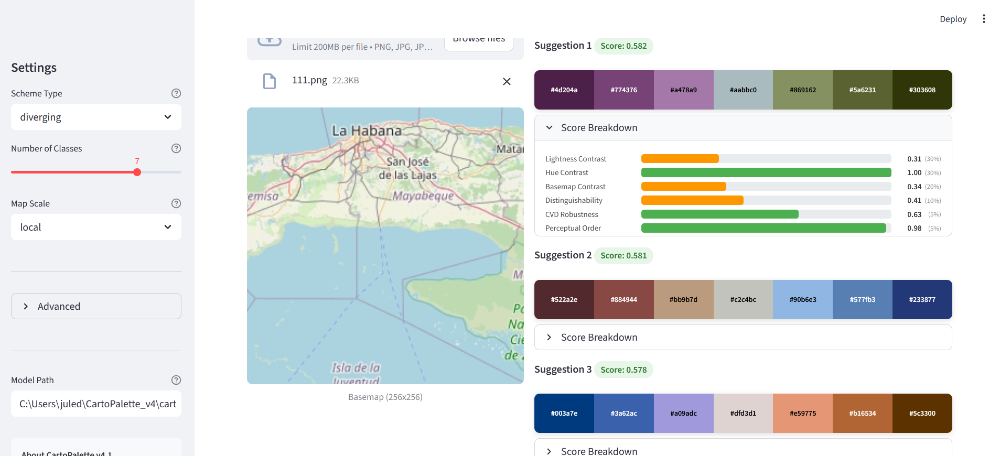

# CartoPalette

> Context-aware colour palette generation for thematic maps.

CartoPalette automatically generates colour palettes conditioned on an uploaded basemap image. Instead of selecting from fixed palette libraries, the system proposes multiple plausible palettes that account for the visual context of the target map.



---

## How it works

CartoPalette uses a four-stage **generator-scorer-reranker** pipeline:

| Stage | What happens |
|-------|-------------|
| **1. Generate** | A CVAE with EfficientNet-B0 encoder generates *k* = 20 candidate palettes from basemap features and cartographic metadata |
| **2. Score** | Each candidate is evaluated on six perceptual quality metrics (see below) |
| **3. Filter** | Darkness guardrails remove candidates that appear too heavy on bright basemaps |
| **4. Select** | Maximal Marginal Relevance (MMR) picks three diverse final suggestions |

## Composite quality score

Each palette is scored on six cartographic criteria:

| Metric | Weight | What it measures |
|--------|--------|-----------------|
| Lightness contrast | 30% | Palette L\* separation from basemap lightness zones |
| Hue contrast | 30% | Chroma-weighted hue separation from basemap |
| Basemap contrast | 20% | Worst-case + mean CIEDE2000 to basemap colours |
| Distinguishability | 10% | Minimum pairwise CIEDE2000 within palette |
| CVD robustness | 5% | Distinguishability under simulated colour vision deficiency |
| Perceptual ordering | 5% | L\* monotonicity and step uniformity |

The web app shows an expandable **Score Breakdown** for each suggestion, so users can inspect individual metric values and choose the palette whose trade-off profile best fits their design needs.

---

## Installation

```bash
git clone https://github.com/J-Drews/CartoPalette.git
cd CartoPalette
pip install -e ".[web]"
```

### Model download

The pretrained model `cartopalette_v4.pt` (23 MB) is available under [Releases](https://github.com/J-Drews/CartoPalette/releases).

Download it and place it in:

```
cartopalette/pretrained/cartopalette_v4.pt
```

## Usage

### Web app

```bash
streamlit run web/app.py
```

Upload a basemap image, choose scheme type (sequential / diverging), number of classes (3-9), and map scale. The app displays three palette suggestions with score breakdowns.

### Python API

```python
from cartopalette.core.inference import CartoPalette

cp = CartoPalette("cartopalette/pretrained/cartopalette_v4.pt")

palettes = cp.suggest(
    "basemap.png",
    scheme="sequential",   # or "diverging"
    n_classes=5,           # 3, 4, 5, 7, or 9
    scale="regional",      # "overview", "regional", or "local"
)

for p in palettes:
    print(p.hex_colors, f"score={p.score:.3f}")
```

---

## Project structure

```
CartoPalette/
  cartopalette/            Core Python package
    core/
      model.py             CVAE architecture (EfficientNet-B0 + decoder)
      inference.py          Inference pipeline (generate-score-filter-select)
    scoring/
      composite.py         Six-metric composite quality score
    pretrained/            Model weights (download from Releases)
  web/
    app.py                 Streamlit web interface
  research/                Data pipeline and utilities
  configs/                 YAML configuration files
```

## Training data

The model was trained on 238,750 diversity-aware labels derived from 13.49 million candidate palettes across 47,750 basemap configurations covering multiple map styles, zoom levels, and geographic locations.

## Citation

```bibtex
@article{cartopalette2026,
  title   = {CartoPalette: Context-Aware Colour Palette Generation for Thematic
             Maps Using a CVAE-Based Generator-Scorer-Reranker Pipeline},
  author  = {Drews, J.},
  journal = {},
  year    = {2026}
}
```

## License

This project is part of ongoing doctoral research. License details will be added upon publication.
